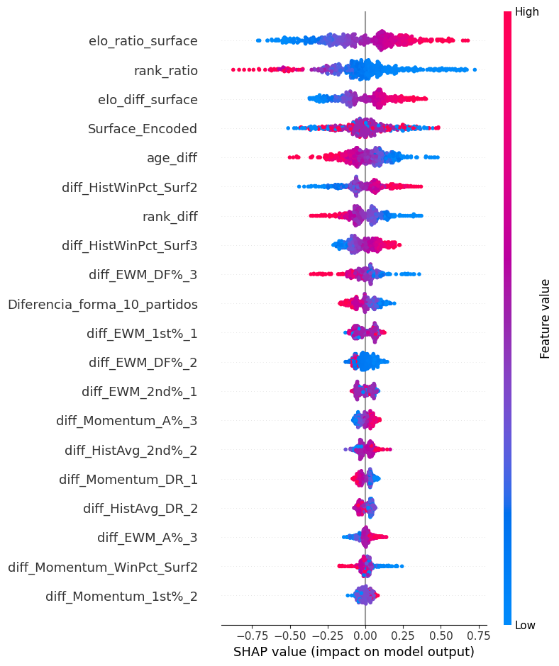
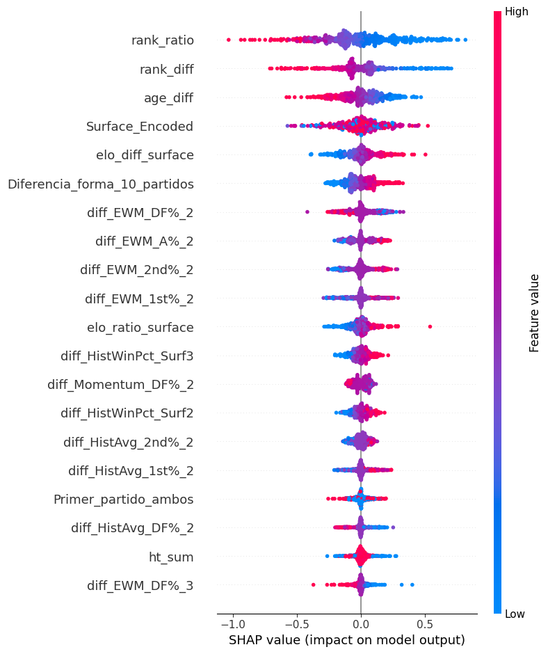

# 🎾 Tennis Match Prediction — Pipeline ML End-to-End

Este repositorio contiene un pipeline completo de Machine Learning diseñado para predecir el resultado de partidos de tenis profesional, desarrollado como proyecto personal por curiosidad. Cubre datos del circuito ATP y Challenger entre 2002 y 2025.

El proyecto destaca por el uso de **ingeniería de características temporales**, **calibración probabilística diferenciada** y **explicabilidad del modelo (SHAP)**, así como por una validación rigurosa que evita la filtración de información futura (*data leakage*).

---

## 📌 Contexto y Reto

En el tenis, las métricas estáticas (como el ranking actual) son insuficientes para capturar la realidad competitiva en el momento exacto del partido. Este proyecto construye variables dinámicas que miden la "forma" real y el nivel histórico (ELO) de cada jugador justo antes del enfrentamiento.

Se desarrollaron dos modelos independientes adaptados a las naturalezas distintas de cada circuito:

- **Modelo ATP:** Especialización y estabilidad de la élite. Predictor clave: ELO específico por superficie.
- **Modelo Challenger:** Alta varianza y desarrollo de jóvenes talentos. Predictores clave: ratio de ranking y diferencia de edad.

---

## 🤖 Metodología de Desarrollo: AI-Augmented Engineering

- **Rol del Data Scientist:** Arquitectura del sistema, diseño de hipótesis (uso del Brier Score como métrica de optimización, filtro Anti-COVID, simetrización del dataset), validación de decisiones técnicas y supervisión.
- **Rol de la IA:** Aceleración en la escritura de código, optimización de algoritmos de cálculo iterativo (ELO, H2H) y generación de estructuras de modelado.

---

## 🚀 Pipeline Técnico (End-to-End)

### 1. Ingeniería de Datos y Características (`preparacion_datos_ganador.ipynb`)

**Simetrización del dataset:** Duplicación de datos invirtiendo el target y los atributos de jugador A/B, eliminando el sesgo de posición y forzando al modelo a aprender dinámicas reales de Head-to-Head. Incluye auditoría automática de simetría.

**Features temporales construidas:**

- **ELO dinámico por superficie** con K-factor variable según nivel del torneo (Grand Slam=40, ATP=30, Challenger=15). Calculado cronológicamente para evitar filtración de datos futuros.
- **Victorias en los últimos 10 partidos** (rolling window) por jugador.
- **H2H histórico** calculado de forma estrictamente cronológica (el historial se actualiza *después* de cada partido, no antes).
- **Minutos y partidos acumulados** en cada edición de torneo (proxy de fatiga).
- **Medias ponderadas exponenciales (EWM)** de estadísticas técnicas (aces, dobles faltas, % primer servicio) segregadas por superficie.
- **Transformación logarítmica del ranking** para linealizar la diferencia de nivel entre jugadores.
- Variables diferenciales (A - B) y ratios para toda feature relevante.

**Control de data leakage:** Las columnas que solo se conocen al terminar el partido (`Total_juegos`, `Numero_sets`, `duracion_min`, `Rd_Ordinal`) se excluyen sistemáticamente del entrenamiento.

**Filtro Anti-COVID:** Los años 2020-2021 se excluyen del entrenamiento por sus patrones estadísticos atípicos (burbujas, ausencias masivas, cancelaciones).

### 2. Modelado Predictivo

**`modelos_prediccion_ganador.ipynb` — Modelo ATP:**

- Benchmark de ventana temporal óptima de entrenamiento (2015 vs. 2018) usando `PredefinedSplit` con año fijo de validación.
- `RandomizedSearchCV` con 200 iteraciones sobre hiperparámetros de XGBoost.
- Selección de variables con `SelectFromModel` (umbral `0.2*mean`).
- Comparativa de 5 estrategias de calibración probabilística.
- Backtesting de ROI sobre datos de 2025 para selección del modelo final.
- **Modelo final:** Ensemble de 5 XGBoost con seeds distintos (42-46) para reducir varianza, con regularización fuerte (`reg_lambda=10`, `reg_alpha=5`, `gamma=2`).

**`modelos_prediccion_ganador_challenger.ipynb` — Modelo Challenger:**

- Misma metodología con ventana desde 2002 (mayor histórico disponible en Challenger).
- Árbol más profundo (`max_depth=7`) y más árboles (2000) por la mayor varianza del circuito.
- **Modelo final:** XGBoost base con **calibración Beta personalizada** implementada desde cero: transformación `[log(p), -log(1-p)]` + regresión logística ajustada sobre datos de 2024.

### 3. Explicabilidad (SHAP)

Análisis SHAP sobre muestras de 500 partidos recientes para entender qué variables dirige el modelo en cada circuito:

| Circuito | Driver principal (SHAP) | Lógica detectada |
|---|---|---|
| **ATP** | `elo_ratio_surface` | En la élite, el rendimiento histórico por superficie es el predictor más fiable |
| **Challenger** | `rank_ratio` / `age_diff` | La brecha de ranking y la energía física son determinantes ante la irregularidad del ELO |

**Modelo ATP — Importancia de variables (SHAP):**



El modelo ATP sitúa `elo_ratio_surface` como variable dominante con el mayor rango de impacto (hasta ±0.75 en el output). Su patrón de color confirma la dirección esperada: valores altos de ELO relativo en superficie (rosa) aumentan la probabilidad de victoria, mientras que valores bajos (azul) la reducen. Destaca también que `rank_ratio` aparece en segunda posición pero con el patrón de color invertido respecto al ELO, lo que refleja que el modelo ha aprendido la diferencia entre ranking actual (más volátil) y ELO histórico por superficie (más estable y predictivo en el circuito principal).

**Modelo Challenger — Importancia de variables (SHAP):**



El modelo Challenger invierte la jerarquía: `rank_ratio` y `rank_diff` son los predictores más influyentes, con un rango de impacto superior (hasta ±1.0). La variable `age_diff` escala al tercer puesto, validando la hipótesis de que la juventud es determinante en un circuito caracterizado por la irregularidad. Nótese cómo `elo_ratio_surface` cae al puesto 11, confirmando que la especialización histórica por superficie tiene menor valor predictivo en el circuito de ascenso.

---

## 📈 Resultados

Evaluados sobre partidos de 2025 completamente aislados del entrenamiento:

| Modelo | Accuracy | Brier Score |
|---|---|---|
| **ATP** | 64.22% | 0.219 |
| **Challenger** | 63.53% | 0.228 |

El Brier Score mide la calidad de las probabilidades predichas (no solo si acertó o no), garantizando que las probabilidades están matemáticamente calibradas y son utilizables en aplicaciones reales.

---

## 🛠️ Stack Tecnológico

**Python:** `XGBoost`, `Scikit-Learn`, `SHAP`, `pandas`, `numpy`, `matplotlib`, `seaborn`

**Entorno:** Jupyter Notebooks / Google Colab

---

## 📁 Estructura del Repositorio

```
├── preparacion_datos_ganador.ipynb              # Ingeniería de datos y características
├── modelos_prediccion_ganador.ipynb             # Modelo ATP
├── modelos_prediccion_ganador_challenger.ipynb  # Modelo Challenger
├── grafica_sharp_ATP.png                        # Análisis SHAP — Modelo ATP
├── grafica_sharp_challenger.png                 # Análisis SHAP — Modelo Challenger
└── README.md
```

> El dataset de entrenamiento (`partidos_entrenamiento_modelo.csv`) no está incluido en el repositorio.

**Fuente de datos:** Los datos históricos de partidos (2000-2025) proceden del repositorio público [**tennis_atp** de Jeff Sackmann](https://github.com/jeffsackmann/tennis_atp), una de las fuentes de datos de tenis más completas y utilizadas en la comunidad de análisis deportivo.

---

## ▶️ Cómo Ejecutar

**Requisitos:**
```bash
pip install pandas numpy matplotlib seaborn scikit-learn xgboost shap joblib
```

**Orden de ejecución:**
1. `preparacion_datos_ganador.ipynb` → genera `partidos_entrenamiento_modelo.csv`
2. `modelos_prediccion_ganador.ipynb` → entrena y guarda el modelo ATP
3. `modelos_prediccion_ganador_challenger.ipynb` → entrena y guarda el modelo Challenger

---

## 🔍 Limitaciones y Trabajo Futuro

Este proyecto fue desarrollado por curiosidad personal y tiene margen de mejora claro en su presentación:

- **EDA ausente:** No hay análisis exploratorio formal antes del modelado. Sería el primer paso a añadir.
- **Sin baseline explícito:** Falta comparativa contra modelos simples (predicción por ranking, regresión logística) para contextualizar el 64% de accuracy.
- **Reproducibilidad mejorable:** Los notebooks contienen rutas absolutas locales que requieren adaptación manual. Un `requirements.txt` y rutas relativas lo resolverían.
- **Notebooks sin refactorizar:** El código muestra el proceso iterativo de desarrollo. Una versión limpia con markdown explicativo entre secciones mejoraría la legibilidad.

---

## 🔗 Portfolio

Este proyecto forma parte de mi portfolio de Ciencia de Datos junto con:

**[🌿 Análisis Químico del AOVE de Alta Montaña](../aove_mountolive/)** — Pipeline completo de análisis estadístico (R + Python) sobre la composición química del aceite de oliva virgen extra en función de la altitud del olivar. Análisis de más de 100 compuestos químicos con ANOVA, Kruskal-Wallis y ART-ANOVA sobre datos de investigación postdoctoral real.

---

**👤 Diego Herrera Ochoa**
*Data Scientist | PhD en Ciencias de la Salud*
[LinkedIn](https://www.linkedin.com/in/diego-herrera-ochoa-314015377)

---
*Proyecto personal presentado como parte del portfolio del [Máster en Data Science e IA — Evolve Academy](https://evolve.es).*
